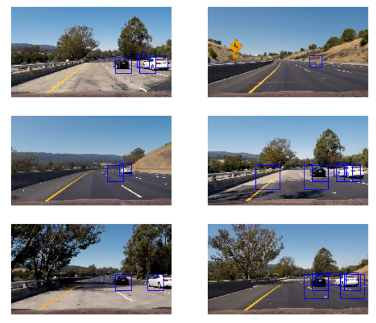
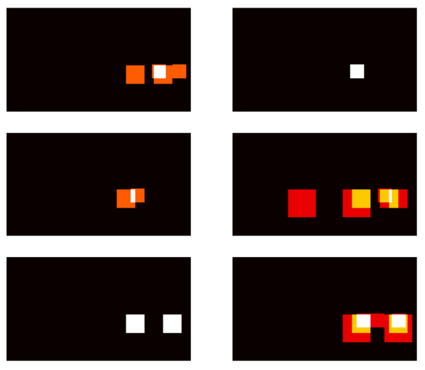
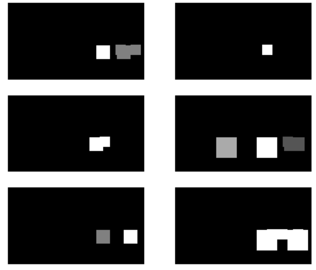
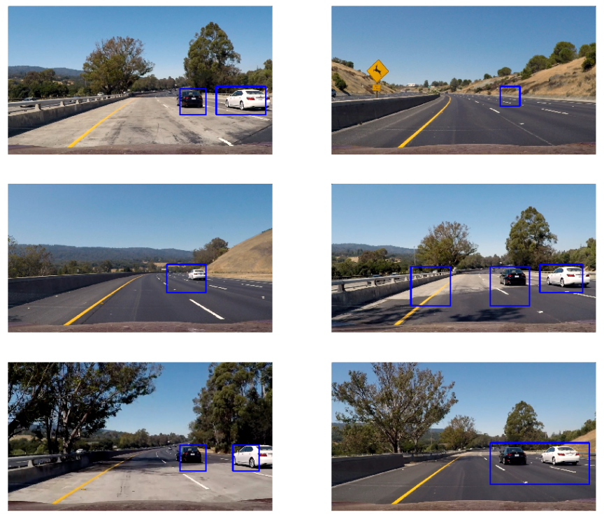

**Vehicle Detection Project**

The goals / steps of this project are the following:

* Perform a Histogram of Oriented Gradients (HOG) feature extraction on a labeled training set of images and train a classifier Linear SVM classifier
* Optionally, you can also apply a color transform and append binned color features, as well as histograms of color, to your HOG feature vector. 
* Note: for those first two steps don't forget to normalize your features and randomize a selection for training and testing.
* Implement a sliding-window technique and use your trained classifier to search for vehicles in images.
* Run your pipeline on a video stream (start with the test_video.mp4 and later implement on full project_video.mp4) and create a heat map of recurring detections frame by frame to reject outliers and follow detected vehicles.
* Estimate a bounding box for vehicles detected.


## [Rubric](https://review.udacity.com/#!/rubrics/513/view) Points
### Here I will consider the rubric points individually and describe how I addressed each point in my implementation.  

---
### Writeup / README

#### 1. Provide a Writeup / README that includes all the rubric points and how you addressed each one.  

This file is the writeup.


### Histogram of Oriented Gradients (HOG)

#### 1. Explain how (and identify where in your code) you extracted HOG features from the training images.

The code for this step is contained in jupyter notebook named `training_session.ipynb`.  

I started by reading in all the `vehicle` and `non-vehicle` images as training data.  Here is an example of one of each of the `vehicle` and `non-vehicle` classes:


I then explored different color spaces and different `skimage.hog()` parameters (`orientations`, `pixels_per_cell`, and `cells_per_block`).  I grabbed random images from each of the two classes and displayed them to get a feel for what the `skimage.hog()` output looks like.

Here is an example using the `RGB` color space and HOG parameters of `orientations=9`, `pixels_per_cell=(8, 8)` and `cells_per_block=(2, 2)`:


this image is not contained in `training_session.ipynb`

#### 2. Explain how you settled on your final choice of HOG parameters.

Firstly I tried to rely on test accuracy of the classification, however this test score seems not directly correlated to the detection accuracy in the video, therefore I used capture image (as provided as 6 test images) to judge if parameter are good or not.

I have tried several color space and parameters and found that the `RGB` color space and HOG parameters of `orientations=11`, `pixels_per_cell=(16, 16)` and `cells_per_block=(2, 2)`: works OK. 


#### 3. Describe how (and identify where in your code) you trained a classifier using your selected HOG features (and color features if you used them).

I trained a linear SVM with the default parameters and used HOG feature only. I have not used spatial or histgram.


### Sliding Window Search

#### 1. Describe how (and identify where in your code) you implemented a sliding window search.  How did you decide what scales to search and how much to overlap windows?

This is coded in Jupyter notebook named `Tracking_and_VideoStream_session.ipynb`, in the cell 12, function named `show_image(image)`.

3 different window size has been set in order to detect vehicle in each position (large size will be used to detect car in close distance with 50% overlap.

here is the code for serch area and box size. 
```
    windows2 = slide_window(image, x_start_stop=[None, None], y_start_stop=[390,400+96], 
                        xy_window=(96, 96), xy_overlap=(0.5, 0.5))
    windows3 = slide_window(image, x_start_stop=[None, None], y_start_stop=[400,400+128], 
                        xy_window=(128, 128), xy_overlap=(0.5, 0.5))
    windows4 = slide_window(image, x_start_stop=[None, None], y_start_stop=[400,400+192], 
                        xy_window=(192, 192), xy_overlap=(0.5, 0.5))
```

small window `(96,96)` is used to serch car in far position, and large window `(192,192)` is used to serch car near by. I also tried `(64,64)` and `(256,256)` window, and with more overlap up to 75%. However those made more false positive, and made program heavy.
On the other hand, I also tried with 96 and 128, that also gave OK result, however white car position is sometime lost ( = program made false negative result) after the car go thru bridge. 
Therefore 3 serch window size with 50% overlap seems a good balance for my feature extract method.  


#### 2. Show some examples of test images to demonstrate how your pipeline is working.  What did you do to optimize the performance of your classifier?

I tuned parameters based on test image captured from video (described in HOG - 1 topic above), I tuned parameters to `orientations=11`, `pixels_per_cell=(16, 16)` and `cells_per_block=(2, 2)` with RGB color space, works OK. also window size is adjusted to reduce false positive and false negative as possible as I can.
Here are example of pipeline result images:


---

### Video Implementation

#### 1. Provide a link to your final video output.  Your pipeline should perform reasonably well on the entire project video (somewhat wobbly or unstable bounding boxes are ok as long as you are identifying the vehicles most of the time with minimal false positives.)
Here's a [link to my video result](./project_video_out.mp4)


#### 2. Describe how (and identify where in your code) you implemented some kind of filter for false positives and some method for combining overlapping bounding boxes.

I recorded the positions of positive detections in each frame of the video.  From the positive detections I created a heatmap and then thresholded that map to identify vehicle positions.  I then used `scipy.ndimage.measurements.label()` to identify individual blobs in the heatmap.  I then assumed each blob corresponded to a vehicle.  I constructed bounding boxes to cover the area of each blob detected.  

Also I stacked 20 frame heatmap data, and dropped data if box is not there for more than 18 frame, so that I can delete false positive box. This filtering is in Jupyter notebook named  `Tracking_and_VideoStream_session.ipynb`, in `pipeline_video` function.

Here's an example result showing the heatmap from a series of frames of video, the result of `scipy.ndimage.measurements.label()` and the bounding boxes then overlaid on the last frame of video:

### Here are six frames and their corresponding heatmaps:





### Here is the output of `scipy.ndimage.measurements.label()` on the integrated heatmap from all six frames:


### Here the resulting bounding boxes are drawn onto the last frame in the series:


---

### Discussion

#### 1. Briefly discuss any problems / issues you faced in your implementation of this project.  Where will your pipeline likely fail?  What could you do to make it more robust?

I think those are problems and points that need to be improved.

1. Parameter tuning 
There are a lot of try and error for manual parameter tuning for feature extract and hot-box tracking. White vehicle position is sometime missed, false negative case can be seen when I tried to reduce false positive. I tuned parameter of heatmap threshold to try to get best point to do not have both false negative and false positive, but is very hard to find variable that do not create both of false case. 
The best valuable should be different for different feature extract method, I guess. I could not try all of parameters and there may be better way to find best parameter if I can implement parameter tuning automation.

2. Vehicle on other side
Sometime vehicle on other side is detected, which idealy should not be detected. Reasion of interest (or limit sliding window serch "X" direction) should improve this, but I was not sure is I should do. In this video, vehicle is always on left lane so I could remove left-up portion, but if vehicle is on right lane, that area should be a resion of interest. This maight be handled by code like check "where I am" , and change reasion of interest. (this could be from lane finiding method like previous project)


